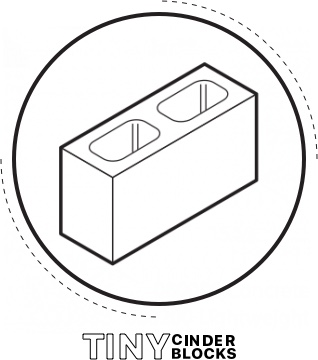

   

### Intro
This is a boilerplate project set up for an express server running a react client with redux, thunk, and react-router. With the intention of getting started on more projects faster, I decided to create a quick start project using the technologies I am most comfortable with at the moment.

### Installation
This project utilizes two separate package.json files - one in the root directory to run the express server, and one in the client directory to configure the react, redux, and react-router. So `npm install` will need to be run in both ./ and ./client. The client react instance was created with `create-react-app client` as a starting point.

To run on a local machine, `npm run dev` will concurrently run watch on the root express server and the react app dev server within ./client.

### Structure
There are a few key concepts used in the structure of this app:

##### Express Server
- the root folder holds an express server, the client folder holds everything related to the react app
- additional express routes (for something like an api) can be added via `express.Router()` within the /routes folder
- app.js will decide whether to use the create-react-app dev server or production build via the `NODE_ENV` variable

##### The Client
- index.js holds the Provider and Router for the full application, connecting both the Redux store and history at this top level
- The App component is simply a version of the Main component connected to the Redux store via the `connect` function
- As a starting point for the state, I created two slices of state in the form of Cogs and Sprockets with actions to add and remove each
- For development purposes, the client's package.json has a `proxy` key pointing to the express server, should the express server's routes need to be utilized.

### Technical Choices
I utilize Redux for state management and Thunk in case I want to make an async call. [Thunk](https://github.com/reduxjs/redux-thunk) allows me to create a series of actions called within actionCreators.js, such as `fetchItemsBegin()`, `fetchItemsSuccess()`, and `fetchItemsError` - then dispatching all these actions within a roll-up action that could be called `fetchItems`.

Additionally, for troubleshooting purposes I opted to use [connected-react-router](https://github.com/supasate/connected-react-router), so anytime the route changes via push state, this would be registered as an action within Redux dev tools. This is set up within ./client/src/store.js, though it not necessary for the app to work.

### Future Considerations
This is pretty bare bones just so I can get started quickly in the future. Items I may consider adding as I get more advanced are:

- using something more elegant than thunk for my data fetching, like [Saga](https://github.com/redux-saga/redux-saga).
- connecting a MongoDB via mongoose in start.js to store data remotely
- applying middleware and error handling to my express server within app.js